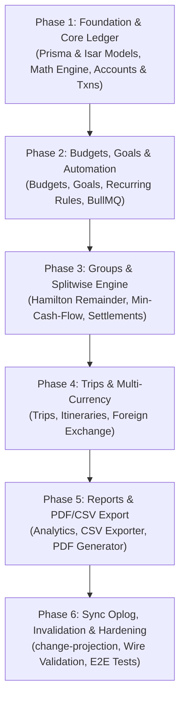

# Prompt: Develop a Complete Money Manager Module for AllInOne & AllMyNote

Build and integrate a production-grade, offline-first **Money Manager (Finance)** module into the existing **AllInOne** ecosystem.

This document converts the generic development prompt into a concrete, rigorous, full-stack architectural specification and implementation guide tailored specifically for:
- **Backend**: `~/Documents/PersonalProject/AllinOne` (NestJS 11, TypeScript, Prisma 5 with MongoDB, Redis + BullMQ, Socket.io Real-Time Gateway, Monotonic Cursors, Argon2id/JWT Auth).
- **Frontend**: `~/Documents/PersonalProject/allmynote_frontend` (Flutter SDK ^3.12.2 / Dart 3.13+, Linux Desktop + Multiplatform, Isar Plus `local_store_v4.dart`, `SyncManager` offline oplog, `Session`, `AppSection` shell, `UserSettingsService`, `AppTheme` / `NotesTokens`, `pdf` / `printing`).

Do not rewrite existing features, do not replace the existing architecture, and do not introduce unneeded third-party libraries. Follow every convention already established in the codebase.

---

## 1. Project Context & Architectural Grounding

### 1.1 Existing Ecosystem Architecture
The application currently delivers Notes, Hierarchical Folders, Tasks/Todos, Calendars/Events, Habits, and an Encrypted Password Vault.

```
┌────────────────────────────────────────────────────────────────────────┐
│                   Flutter Client (allmynote_frontend)                  │
│                                                                        │
│   AppSection: [Dashboard, Habits, Notes, Vault, Calendar, Tasks]       │
│                               ▲                                        │
│             Repositories (Event, Habit, Notes, Task, Vault)            │
│                               ▲                                        │
│   LocalStore (Isar Plus v4: NoteRow, TaskRow, EventRow, VaultRow...)   │
│                               ▲                                        │
│   SyncManager (push queue: SyncQueueRow, pull cursor: SyncMetaRow)     │
└───────────────────────────────┬────────────────────────────────────────┘
                                │ HTTP /sync/push & /sync/pull
                                │ WebSocket: /sync namespace (sync:invalidation)
                                ▼
┌────────────────────────────────────────────────────────────────────────┐
│                      NestJS Backend (AllinOne)                         │
│                                                                        │
│   Controllers: /notes, /tasks, /calendars, /collaboration, /sync       │
│                               ▲                                        │
│   SyncService & ChangeProjection:                                      │
│     - Validates payloads with DOCUMENT_SHAPES                          │
│     - Appends to Change oplog with monotonic SyncCursor               │
│     - Projects changes directly to Prisma Models                       │
│     - Emits sync:invalidation to Redis-backed Socket.io                │
│                               ▲                                        │
│   Prisma ORM (MongoDB: User, Note, Task, Event, ResourceShare...)     │
│   BullMQ Workers (Mail, Notifications, Export, Maintenance)            │
└────────────────────────────────────────────────────────────────────────┘
```

### 1.2 Target Integration Points for Money Manager
1. **Frontend Navigation**: Add `AppSection.finance` to `lib/ui/shell/app_section.dart` and `kShellSections`. Add to `UserSettingsService.defaultModules`. Mount in `lib/ui/shell/main_layout.dart`.
2. **Local Storage**: Add finance collection rows (`AccountRow`, `CategoryRow`, `TransactionRow`, `BudgetRow`, `SavingsGoalRow`, `RecurringRuleRow`, `LoanRow`, `FinanceGroupRow`, `SharedExpenseRow`, `ExpenseShareRow`, `SettlementRow`, `TripRow`, `TripItineraryRow`) into `lib/storage/local_store_v4.dart`.
3. **Offline Sync**: Register finance entity kinds in `SYNC_ENTITY_TYPES` inside `AllinOne/src/sync/change-payload.validator.ts`, define strict validation in `DOCUMENT_SHAPES`, and implement projection logic in `AllinOne/src/sync/change-projection.ts`.
4. **Backend REST & Collaboration**: Add `FinanceModule` under `AllinOne/src/finance/`. Wire group and trip permissions to the existing `ResourceShare` schema (`resourceType: "EXPENSE_GROUP" | "TRIP"`).
5. **Background Processing**: Add a `@Processor('finance')` queue processor in `AllinOne/src/queues/processors/` to handle daily recurring bill generation and budget threshold alerts.

---

## 2. Core Financial Rules & Precision Math Engine

### 2.1 Integer Minor Units (Absolute Prohibition of Binary Floats)
- **Zero Floating Point Storage**: No currency amount may ever be stored or transmitted as a floating-point number (`float` or `double`).
- **Minor Units Representation**: Store all monetary values as 64-bit integers (`BigInt` in Prisma/TypeScript, `int` in Dart/Isar).
  - INR: 1 Rupee = 100 paise (`₹1,250.50` $\rightarrow$ `125050`).
  - USD: 1 Dollar = 100 cents (`$45.00` $\rightarrow$ `4500`).
  - JPY: 1 Yen = 1 yen (`¥500` $\rightarrow$ `500`).
- **Precision Safe Conversions**: All UI conversions from user input strings to minor units must occur via integer parsing:
  $$\text{minorUnits} = \text{round}(\text{decimalAmount} \times 10^{\text{decimals}})$$
- **Safe Money Arithmetic**:
  - Additions and subtractions are pure integer operations.
  - Multiplications (e.g., percentages, tax, interest) must use integer division with explicit rounding modes (`RoundingMode.halfUp` or deterministic largest-remainder distribution).

### 2.2 Deterministic Remainder Allocation (Hamilton / Largest-Remainder Method)
When splitting an expense where the division produces fractions of minor units (e.g., ₹100 split 3 ways is $10000 \div 3 = 3333.333\dots$ paise):
1. Compute base share: $\lfloor 10000 / 3 \rfloor = 3333$ paise per person.
2. Compute residual remainder: $10000 - (3333 \times 3) = 1$ paise.
3. Sort participant IDs alphabetically to guarantee identical output regardless of platform or isolate.
4. Distribute 1 paise to the first $R$ sorted participants.
5. Invariant: $\sum_{i=1}^{N} \text{share}_i \equiv \text{totalAmountMinor}$ down to the exact single minor unit.

### 2.3 Splitwise-Style Debt Simplification (Min-Cash-Flow Algorithm)
In shared groups and trips, members frequently pay expenses for subsets of the group. Avoid pairwise debt spiderwebs (e.g., A owes B ₹500, B owes C ₹500 $\rightarrow$ 2 transfers).
1. Compute the **net balance** $B_u$ for every participant $u$:
   $$B_u = \sum \text{Paid By } u - \sum \text{Owed By } u$$
   Note that $\sum_{u} B_u = 0$.
2. Filter participants into **Debtors** ($B_u < 0$) and **Creditors** ($B_u > 0$).
3. Run a greedy settlement optimizer:
   - Match the largest debtor with the largest creditor.
   - Settle $\min(|B_{\text{debtor}}|, B_{\text{creditor}})$.
   - Update balances and repeat until all balances reach 0.
4. The system presents these optimal transfers as recommended settlements. Any manual settlement recorded updates individual share rows and reduces net balances.

### 2.4 Separation of Personal vs. Shared Spending (No Double-Counting)
When user Alice pays ₹3,000 for dinner split equally between Alice, Bob, and Charlie:
1. **Account Impact**: Alice's Bank Account balance decreases by ₹3,000.
2. **Personal Expense**: Alice's personal expense dashboard records only **₹1,000** (her personal share under Category: *Food & Dining*).
3. **Receivables**: Alice has an asset/receivable of ₹1,000 from Bob and ₹1,000 from Charlie.
4. **Reimbursements**: When Bob sends ₹1,000 to Alice, Alice's bank account increases by ₹1,000 as a **Debt Settlement / Transfer**, NOT as new income. This avoids inflating Alice's monthly income or expense totals.

---

## 3. Database Schemas

### 3.1 Backend: Prisma Schema (`AllinOne/prisma/schema.prisma`)

Add the following models and enums to the Prisma MongoDB schema:

```prisma
// ============================================================================
// Finance & Money Manager Module
// ============================================================================

enum FinanceAccountType {
  CASH
  BANK
  WALLET
  CREDIT
  INVESTMENT
  SAVINGS
  OTHER
}

enum FinanceTransactionType {
  INCOME
  EXPENSE
  TRANSFER
}

enum FinanceBudgetPeriod {
  WEEKLY
  MONTHLY
  QUARTERLY
  YEARLY
  CUSTOM
}

enum FinanceRecurringFrequency {
  DAILY
  WEEKLY
  BIWEEKLY
  MONTHLY
  QUARTERLY
  YEARLY
}

enum FinanceLoanType {
  LENT
  BORROWED
}

enum FinanceSplitType {
  EQUAL
  EXACT
  PERCENTAGE
  SHARES
  ITEMIZED
}

model FinanceAccount {
  id                  String             @id @default(uuid()) @map("_id")
  userId              String
  name                String
  type                FinanceAccountType @default(BANK)
  currency            String             @default("INR")
  openingBalanceMinor BigInt             @default(0)
  currentBalanceMinor BigInt             @default(0)
  color               String?
  iconKey             String?
  isArchived          Boolean            @default(false)
  sortOrder           Int                @default(0)
  deletedAt           DateTime?
  version             Int                @default(1)
  createdAt           DateTime           @default(now())
  updatedAt           DateTime           @updatedAt

  user         User                 @relation(fields: [userId], references: [id], onDelete: Cascade)
  transactions FinanceTransaction[] @relation("AccountTransactions")
  transfersIn  FinanceTransaction[] @relation("TransferToAccount")

  @@index([userId, deletedAt])
  @@map("finance_accounts")
}

model FinanceCategory {
  id        String                 @id @default(uuid()) @map("_id")
  userId    String?                // null indicates system default category
  name      String
  type      FinanceTransactionType @default(EXPENSE)
  iconKey   String?
  color     String?
  parentId  String?
  isSystem  Boolean                @default(false)
  deletedAt DateTime?
  version   Int                    @default(1)
  createdAt DateTime               @default(now())
  updatedAt DateTime               @updatedAt

  transactions FinanceTransaction[]
  budgets      FinanceBudget[]

  @@index([userId, type, deletedAt])
  @@map("finance_categories")
}

model FinanceTransaction {
  id                   String                 @id @default(uuid()) @map("_id")
  userId               String
  accountId            String
  toAccountId          String?                // For transfers between accounts
  categoryId           String?
  type                 FinanceTransactionType
  amountMinor          BigInt
  currency             String                 @default("INR")
  title                String
  notes                String?
  tags                 String[]               @default([])
  transactionDate      DateTime
  receiptAttachmentId  String?
  recurringRuleId      String?
  sharedExpenseId      String?
  isExcludedFromBudget Boolean                @default(false)
  deletedAt            DateTime?
  version              Int                    @default(1)
  createdAt            DateTime               @default(now())
  updatedAt            DateTime               @updatedAt

  user        User             @relation(fields: [userId], references: [id], onDelete: Cascade)
  account     FinanceAccount   @relation("AccountTransactions", fields: [accountId], references: [id], onDelete: Cascade)
  toAccount   FinanceAccount?  @relation("TransferToAccount", fields: [toAccountId], references: [id], onDelete: SetNull)
  category    FinanceCategory? @relation(fields: [categoryId], references: [id], onDelete: SetNull)

  @@index([userId, transactionDate])
  @@index([accountId, deletedAt])
  @@map("finance_transactions")
}

model FinanceBudget {
  id              String              @id @default(uuid()) @map("_id")
  userId          String
  categoryId      String?             // null represents an overall monthly budget
  amountMinor     BigInt
  period          FinanceBudgetPeriod @default(MONTHLY)
  startDate       DateTime?
  endDate         DateTime?
  alertAt80       Boolean             @default(true)
  alertAt100      Boolean             @default(true)
  alertSentAt     DateTime?
  deletedAt       DateTime?
  version         Int                 @default(1)
  createdAt       DateTime            @default(now())
  updatedAt       DateTime            @updatedAt

  user     User             @relation(fields: [userId], references: [id], onDelete: Cascade)
  category FinanceCategory? @relation(fields: [categoryId], references: [id], onDelete: SetNull)

  @@index([userId, deletedAt])
  @@map("finance_budgets")
}

model FinanceSavingsGoal {
  id                 String    @id @default(uuid()) @map("_id")
  userId             String
  name               String
  targetAmountMinor  BigInt
  currentAmountMinor BigInt    @default(0)
  targetDate         DateTime?
  color              String?
  iconKey            String?
  isCompleted        Boolean   @default(false)
  deletedAt          DateTime?
  version            Int       @default(1)
  createdAt          DateTime  @default(now())
  updatedAt          DateTime  @updatedAt

  user User @relation(fields: [userId], references: [id], onDelete: Cascade)

  @@index([userId, deletedAt])
  @@map("finance_savings_goals")
}

model FinanceRecurringRule {
  id              String                    @id @default(uuid()) @map("_id")
  userId          String
  accountId       String
  categoryId      String?
  type            FinanceTransactionType
  amountMinor     BigInt
  title           String
  frequency       FinanceRecurringFrequency @default(MONTHLY)
  interval        Int                       @default(1)
  startDate       DateTime
  endDate         DateTime?
  nextDueDate     DateTime
  lastGeneratedAt DateTime?
  autoGenerate    Boolean                   @default(true)
  deletedAt       DateTime?
  version         Int                       @default(1)
  createdAt       DateTime                  @default(now())
  updatedAt       DateTime                  @updatedAt

  user User @relation(fields: [userId], references: [id], onDelete: Cascade)

  @@index([userId, nextDueDate, deletedAt])
  @@map("finance_recurring_rules")
}

model FinanceLoan {
  id                   String          @id @default(uuid()) @map("_id")
  userId               String
  type                 FinanceLoanType
  counterpartyName     String
  counterpartyContact  String?
  principalAmountMinor BigInt
  remainingAmountMinor BigInt
  dueDate              DateTime?
  notes                String?
  isSettled            Boolean         @default(false)
  deletedAt            DateTime?
  version              Int             @default(1)
  createdAt            DateTime        @default(now())
  updatedAt            DateTime        @updatedAt

  user User @relation(fields: [userId], references: [id], onDelete: Cascade)

  @@index([userId, isSettled, deletedAt])
  @@map("finance_loans")
}

model FinanceGroup {
  id          String    @id @default(uuid()) @map("_id")
  ownerId     String
  name        String
  description String?
  currency    String    @default("INR")
  iconKey     String?
  isArchived  Boolean   @default(false)
  deletedAt   DateTime?
  version     Int       @default(1)
  createdAt   DateTime  @default(now())
  updatedAt   DateTime  @updatedAt

  owner          User                   @relation(fields: [ownerId], references: [id], onDelete: Cascade)
  sharedExpenses FinanceSharedExpense[]
  settlements    FinanceSettlement[]

  @@index([ownerId, deletedAt])
  @@map("finance_groups")
}

model FinanceSharedExpense {
  id                  String           @id @default(uuid()) @map("_id")
  groupId             String?
  tripId              String?
  paidByUserId        String
  payerAccountId      String?
  title               String
  totalAmountMinor    BigInt
  currency            String           @default("INR")
  splitType           FinanceSplitType @default(EQUAL)
  date                DateTime
  notes               String?
  receiptAttachmentId String?
  deletedAt           DateTime?
  version             Int              @default(1)
  createdAt           DateTime         @default(now())
  updatedAt           DateTime         @updatedAt

  group  FinanceGroup?         @relation(fields: [groupId], references: [id], onDelete: Cascade)
  trip   FinanceTrip?          @relation(fields: [tripId], references: [id], onDelete: Cascade)
  shares FinanceExpenseShare[]

  @@index([groupId, deletedAt])
  @@index([tripId, deletedAt])
  @@map("finance_shared_expenses")
}

model FinanceExpenseShare {
  id              String    @id @default(uuid()) @map("_id")
  sharedExpenseId String
  userId          String
  owedAmountMinor BigInt
  shareUnits      Float?
  isSettled       Boolean   @default(false)
  settledAt       DateTime?
  createdAt       DateTime  @default(now())
  updatedAt       DateTime  @updatedAt

  sharedExpense FinanceSharedExpense @relation(fields: [sharedExpenseId], references: [id], onDelete: Cascade)

  @@index([sharedExpenseId, userId])
  @@map("finance_expense_shares")
}

model FinanceSettlement {
  id            String    @id @default(uuid()) @map("_id")
  groupId       String?
  tripId        String?
  fromUserId    String
  toUserId      String
  amountMinor   BigInt
  currency      String    @default("INR")
  date          DateTime
  notes         String?
  paymentMethod String?
  deletedAt     DateTime?
  version       Int       @default(1)
  createdAt     DateTime  @default(now())
  updatedAt     DateTime  @updatedAt

  group FinanceGroup? @relation(fields: [groupId], references: [id], onDelete: Cascade)
  trip  FinanceTrip?  @relation(fields: [tripId], references: [id], onDelete: Cascade)

  @@index([groupId, deletedAt])
  @@index([tripId, deletedAt])
  @@map("finance_settlements")
}

model FinanceTrip {
  id               String    @id @default(uuid()) @map("_id")
  ownerId          String
  title            String
  destinations     String[]  @default([])
  startDate        DateTime
  endDate          DateTime
  baseCurrency     String    @default("INR")
  totalBudgetMinor BigInt?
  notes            String?
  isArchived       Boolean   @default(false)
  deletedAt        DateTime?
  version          Int       @default(1)
  createdAt        DateTime  @default(now())
  updatedAt        DateTime  @updatedAt

  owner          User                   @relation(fields: [ownerId], references: [id], onDelete: Cascade)
  itineraryItems FinanceTripItinerary[]
  sharedExpenses FinanceSharedExpense[]
  settlements    FinanceSettlement[]

  @@index([ownerId, deletedAt])
  @@map("finance_trips")
}

model FinanceTripItinerary {
  id               String    @id @default(uuid()) @map("_id")
  tripId           String
  dayIndex         Int
  date             DateTime?
  title            String
  plannedCostMinor BigInt?
  notes            String?
  sortOrder        Int       @default(0)
  deletedAt        DateTime?
  version          Int       @default(1)
  createdAt        DateTime  @default(now())
  updatedAt        DateTime  @updatedAt

  trip FinanceTrip @relation(fields: [tripId], references: [id], onDelete: Cascade)

  @@index([tripId, dayIndex])
  @@map("finance_trip_itineraries")
}
```

*Note*: Update the `User` model relations and add back-relations for `financeAccounts`, `financeTransactions`, `financeBudgets`, `financeSavingsGoals`, `financeRecurringRules`, `financeLoans`, `financeGroups`, and `financeTrips`. Expand `ResourceType` in `ResourceShare` to include `"EXPENSE_GROUP"` and `"TRIP"`.

---

### 3.2 Frontend: Isar Collection Schemas (`lib/storage/local_store_v4.dart`)

Define corresponding Isar Plus models with serializable `toMap()` methods and index definitions:

```dart
@collection
class AccountRow {
  @id
  late String accountId;

  @Index()
  String? ownerId;

  late String name;
  String type = 'BANK'; // CASH, BANK, WALLET, CREDIT, INVESTMENT, SAVINGS, OTHER
  String currency = 'INR';
  int openingBalanceMinor = 0;
  int currentBalanceMinor = 0;
  String? color;
  String? iconKey;
  bool isArchived = false;
  int sortOrder = 0;

  String? deletedAt;
  int version = 1;
  late String createdAt;
  late String updatedAt;

  Map<String, dynamic> toMap() => {
    'id': accountId,
    'name': name,
    'type': type,
    'currency': currency,
    'openingBalanceMinor': openingBalanceMinor,
    'currentBalanceMinor': currentBalanceMinor,
    'color': color,
    'iconKey': iconKey,
    'isArchived': isArchived,
    'sortOrder': sortOrder,
    'deletedAt': deletedAt,
    'version': version,
    'createdAt': createdAt,
    'updatedAt': updatedAt,
  };
}

@collection
class CategoryRow {
  @id
  late String categoryId;

  @Index()
  String? ownerId;

  late String name;
  String type = 'EXPENSE'; // INCOME, EXPENSE
  String? iconKey;
  String? color;
  String? parentId;
  bool isSystem = false;

  String? deletedAt;
  int version = 1;
  late String createdAt;
  late String updatedAt;

  Map<String, dynamic> toMap() => {
    'id': categoryId,
    'name': name,
    'type': type,
    'iconKey': iconKey,
    'color': color,
    'parentId': parentId,
    'isSystem': isSystem,
    'deletedAt': deletedAt,
    'version': version,
    'createdAt': createdAt,
    'updatedAt': updatedAt,
  };
}

@collection
class TransactionRow {
  @id
  late String transactionId;

  @Index()
  String? ownerId;

  @Index()
  late String accountId;

  String? toAccountId;
  String? categoryId;
  late String type; // INCOME, EXPENSE, TRANSFER
  late int amountMinor;
  String currency = 'INR';
  late String title;
  String? notes;
  List<String> tags = [];
  late String transactionDate;
  String? receiptAttachmentId;
  String? recurringRuleId;
  String? sharedExpenseId;
  bool isExcludedFromBudget = false;

  String? deletedAt;
  int version = 1;
  late String createdAt;
  late String updatedAt;

  Map<String, dynamic> toMap() => {
    'id': transactionId,
    'accountId': accountId,
    'toAccountId': toAccountId,
    'categoryId': categoryId,
    'type': type,
    'amountMinor': amountMinor,
    'currency': currency,
    'title': title,
    'notes': notes,
    'tags': List<String>.of(tags),
    'transactionDate': transactionDate,
    'receiptAttachmentId': receiptAttachmentId,
    'recurringRuleId': recurringRuleId,
    'sharedExpenseId': sharedExpenseId,
    'isExcludedFromBudget': isExcludedFromBudget,
    'deletedAt': deletedAt,
    'version': version,
    'createdAt': createdAt,
    'updatedAt': updatedAt,
  };
}

@collection
class BudgetRow {
  @id
  late String budgetId;

  @Index()
  String? ownerId;

  String? categoryId; // null = overall monthly budget
  late int amountMinor;
  String period = 'MONTHLY';
  String? startDate;
  String? endDate;
  bool alertAt80 = true;
  bool alertAt100 = true;
  String? alertSentAt;

  String? deletedAt;
  int version = 1;
  late String createdAt;
  late String updatedAt;

  Map<String, dynamic> toMap() => {
    'id': budgetId,
    'categoryId': categoryId,
    'amountMinor': amountMinor,
    'period': period,
    'startDate': startDate,
    'endDate': endDate,
    'alertAt80': alertAt80,
    'alertAt100': alertAt100,
    'alertSentAt': alertSentAt,
    'deletedAt': deletedAt,
    'version': version,
    'createdAt': createdAt,
    'updatedAt': updatedAt,
  };
}

@collection
class SavingsGoalRow {
  @id
  late String goalId;

  @Index()
  String? ownerId;

  late String name;
  late int targetAmountMinor;
  int currentAmountMinor = 0;
  String? targetDate;
  String? color;
  String? iconKey;
  bool isCompleted = false;

  String? deletedAt;
  int version = 1;
  late String createdAt;
  late String updatedAt;

  Map<String, dynamic> toMap() => {
    'id': goalId,
    'name': name,
    'targetAmountMinor': targetAmountMinor,
    'currentAmountMinor': currentAmountMinor,
    'targetDate': targetDate,
    'color': color,
    'iconKey': iconKey,
    'isCompleted': isCompleted,
    'deletedAt': deletedAt,
    'version': version,
    'createdAt': createdAt,
    'updatedAt': updatedAt,
  };
}

@collection
class RecurringRuleRow {
  @id
  late String ruleId;

  @Index()
  String? ownerId;

  late String accountId;
  String? categoryId;
  late String type;
  late int amountMinor;
  late String title;
  String frequency = 'MONTHLY';
  int interval = 1;
  late String startDate;
  String? endDate;
  late String nextDueDate;
  String? lastGeneratedAt;
  bool autoGenerate = true;

  String? deletedAt;
  int version = 1;
  late String createdAt;
  late String updatedAt;

  Map<String, dynamic> toMap() => {
    'id': ruleId,
    'accountId': accountId,
    'categoryId': categoryId,
    'type': type,
    'amountMinor': amountMinor,
    'title': title,
    'frequency': frequency,
    'interval': interval,
    'startDate': startDate,
    'endDate': endDate,
    'nextDueDate': nextDueDate,
    'lastGeneratedAt': lastGeneratedAt,
    'autoGenerate': autoGenerate,
    'deletedAt': deletedAt,
    'version': version,
    'createdAt': createdAt,
    'updatedAt': updatedAt,
  };
}

@collection
class LoanRow {
  @id
  late String loanId;

  @Index()
  String? ownerId;

  late String type; // LENT, BORROWED
  late String counterpartyName;
  String? counterpartyContact;
  late int principalAmountMinor;
  late int remainingAmountMinor;
  String? dueDate;
  String? notes;
  bool isSettled = false;

  String? deletedAt;
  int version = 1;
  late String createdAt;
  late String updatedAt;

  Map<String, dynamic> toMap() => {
    'id': loanId,
    'type': type,
    'counterpartyName': counterpartyName,
    'counterpartyContact': counterpartyContact,
    'principalAmountMinor': principalAmountMinor,
    'remainingAmountMinor': remainingAmountMinor,
    'dueDate': dueDate,
    'notes': notes,
    'isSettled': isSettled,
    'deletedAt': deletedAt,
    'version': version,
    'createdAt': createdAt,
    'updatedAt': updatedAt,
  };
}

@collection
class FinanceGroupRow {
  @id
  late String groupId;

  @Index()
  String? ownerId;

  late String name;
  String? description;
  String currency = 'INR';
  String? iconKey;
  bool isArchived = false;

  String? deletedAt;
  int version = 1;
  late String createdAt;
  late String updatedAt;

  Map<String, dynamic> toMap() => {
    'id': groupId,
    'name': name,
    'description': description,
    'currency': currency,
    'iconKey': iconKey,
    'isArchived': isArchived,
    'deletedAt': deletedAt,
    'version': version,
    'createdAt': createdAt,
    'updatedAt': updatedAt,
  };
}

@collection
class SharedExpenseRow {
  @id
  late String expenseId;

  @Index()
  String? ownerId;

  String? groupId;
  String? tripId;
  late String paidByUserId;
  String? payerAccountId;
  late String title;
  late int totalAmountMinor;
  String currency = 'INR';
  String splitType = 'EQUAL';
  late String date;
  String? notes;
  String? receiptAttachmentId;

  String? deletedAt;
  int version = 1;
  late String createdAt;
  late String updatedAt;

  Map<String, dynamic> toMap() => {
    'id': expenseId,
    'groupId': groupId,
    'tripId': tripId,
    'paidByUserId': paidByUserId,
    'payerAccountId': payerAccountId,
    'title': title,
    'totalAmountMinor': totalAmountMinor,
    'currency': currency,
    'splitType': splitType,
    'date': date,
    'notes': notes,
    'receiptAttachmentId': receiptAttachmentId,
    'deletedAt': deletedAt,
    'version': version,
    'createdAt': createdAt,
    'updatedAt': updatedAt,
  };
}

@collection
class ExpenseShareRow {
  @id
  late String shareId;

  @Index()
  late String sharedExpenseId;

  late String userId;
  late int owedAmountMinor;
  double? shareUnits;
  bool isSettled = false;
  String? settledAt;

  Map<String, dynamic> toMap() => {
    'id': shareId,
    'sharedExpenseId': sharedExpenseId,
    'userId': userId,
    'owedAmountMinor': owedAmountMinor,
    'shareUnits': shareUnits,
    'isSettled': isSettled,
    'settledAt': settledAt,
  };
}

@collection
class SettlementRow {
  @id
  late String settlementId;

  @Index()
  String? ownerId;

  String? groupId;
  String? tripId;
  late String fromUserId;
  late String toUserId;
  late int amountMinor;
  String currency = 'INR';
  late String date;
  String? notes;
  String? paymentMethod;

  String? deletedAt;
  int version = 1;
  late String createdAt;
  late String updatedAt;

  Map<String, dynamic> toMap() => {
    'id': settlementId,
    'groupId': groupId,
    'tripId': tripId,
    'fromUserId': fromUserId,
    'toUserId': toUserId,
    'amountMinor': amountMinor,
    'currency': currency,
    'date': date,
    'notes': notes,
    'paymentMethod': paymentMethod,
    'deletedAt': deletedAt,
    'version': version,
    'createdAt': createdAt,
    'updatedAt': updatedAt,
  };
}

@collection
class TripRow {
  @id
  late String tripId;

  @Index()
  String? ownerId;

  late String title;
  List<String> destinations = [];
  late String startDate;
  late String endDate;
  String baseCurrency = 'INR';
  int? totalBudgetMinor;
  String? notes;
  bool isArchived = false;

  String? deletedAt;
  int version = 1;
  late String createdAt;
  late String updatedAt;

  Map<String, dynamic> toMap() => {
    'id': tripId,
    'title': title,
    'destinations': List<String>.of(destinations),
    'startDate': startDate,
    'endDate': endDate,
    'baseCurrency': baseCurrency,
    'totalBudgetMinor': totalBudgetMinor,
    'notes': notes,
    'isArchived': isArchived,
    'deletedAt': deletedAt,
    'version': version,
    'createdAt': createdAt,
    'updatedAt': updatedAt,
  };
}

@collection
class TripItineraryRow {
  @id
  late String itineraryId;

  @Index()
  late String tripId;

  late int dayIndex;
  String? date;
  late String title;
  int? plannedCostMinor;
  String? notes;
  int sortOrder = 0;

  String? deletedAt;
  int version = 1;
  late String createdAt;
  late String updatedAt;

  Map<String, dynamic> toMap() => {
    'id': itineraryId,
    'tripId': tripId,
    'dayIndex': dayIndex,
    'date': date,
    'title': title,
    'plannedCostMinor': plannedCostMinor,
    'notes': notes,
    'sortOrder': sortOrder,
    'deletedAt': deletedAt,
    'version': version,
    'createdAt': createdAt,
    'updatedAt': updatedAt,
  };
}
```

*Code Generation Command*:
After updating `local_store_v4.dart`, run:
```bash
dart run build_runner build --delete-conflicting-outputs
```

---

## 4. Synchronization & Wire Protocol Integration

### 4.1 Sync Entity Whitelist (`AllinOne/src/sync/change-payload.validator.ts`)
Extend `SYNC_ENTITY_TYPES`:
```typescript
export const SYNC_ENTITY_TYPES = [
  "note",
  "folder",
  "task",
  "event",
  "calendar",
  "habit",
  "habit_log",
  "vault_item",
  // New Finance Entities:
  "finance_account",
  "finance_category",
  "finance_transaction",
  "finance_budget",
  "finance_savings_goal",
  "finance_recurring_rule",
  "finance_loan",
  "finance_group",
  "finance_shared_expense",
  "finance_settlement",
  "finance_trip",
  "finance_trip_itinerary",
] as const;
```

### 4.2 Document Shapes Validation (`DOCUMENT_SHAPES`)
Add shape definitions enforcing integer minor amounts, string bounds, and ISO dates:
- `amountMinor` must be an integer (validate with `Number.isInteger(val) && val >= 0`).
- `currency` must be a 3-character uppercase ISO code.
- Prevent arbitrary payloads from poisoning the sync oplog.

### 4.3 Change Projection (`AllinOne/src/sync/change-projection.ts`)
Map each accepted finance change inside the sync transaction onto its corresponding Prisma model:
- `finance_transaction` updates `currentBalanceMinor` on `FinanceAccount` atomically when projected.
- Transfers adjust both `accountId` (decrease) and `toAccountId` (increase) inside a single Prisma interactive transaction.
- When projection succeeds, `SyncGateway` broadcasts `sync:invalidation` to the user's connected devices via Socket.io.

### 4.4 Client-Side Sync Invalidation & Push
Inside each repository method in `allmynote_frontend`:
```dart
isar.write((isar) {
  isar.transactionRows.put(txRow);
  isar.queueChange('finance_transaction', txRow.transactionId, 'CREATE', txRow.toMap(), now);
});
unawaited(SyncManager.instance.push());
```

---

## 5. Flutter Frontend Architecture & UI Design

### 5.1 Shell Navigation Integration
1. In `lib/ui/shell/app_section.dart`:
   ```dart
   enum AppSection { dashboard, habits, notes, passwordManager, calendar, tasks, finance }
   ```
2. Add to `kShellSections`:
   ```dart
   ShellSectionEntry(
     section: AppSection.finance,
     label: 'Finance',
     outlinedIcon: Icons.account_balance_wallet_outlined,
     filledIcon: Icons.account_balance_wallet,
   ),
   ```
3. Update `UserSettingsService.defaultModules` so existing and new users have the finance module enabled by default.
4. Update `MainLayout._onSectionChanged` to mount `LazySection(builder: () => const FinanceMainScreen())`.

### 5.2 Screens & Component Hierarchy (`lib/ui/finance/`)
Organize files under `lib/ui/finance/`:
```text
lib/ui/finance/
├── finance_main_screen.dart             # Top shell with tab/segment controller
├── dashboard/
│   ├── finance_dashboard_view.dart      # Total balance, monthly cash flow, budget gauges
│   ├── widgets/balance_card.dart        # Net worth breakdown across accounts
│   ├── widgets/cash_flow_chart.dart     # Monthly income vs expense bars
│   └── widgets/quick_action_bar.dart    # Add Expense, Add Income, Transfer modal triggers
├── transactions/
│   ├── transactions_list_view.dart      # Filterable transaction list with date headers
│   ├── transaction_form_sheet.dart      # Modal to add/edit income, expense, or transfer
│   └── transaction_detail_dialog.dart   # View receipt, category, account, and delete action
├── accounts/
│   ├── accounts_view.dart               # Cards for Cash, Bank, Digital Wallets, Credit Cards
│   └── account_transfer_dialog.dart     # Move funds between accounts without expense tracking
├── budgets/
│   ├── budgets_goals_view.dart          # Progress bars (Green < 80%, Amber 80-99%, Red >= 100%)
│   ├── budget_form_dialog.dart          # Set overall or category limit
│   └── savings_goal_card.dart           # Visual goal tracker with deposit dialog
├── recurring/
│   ├── recurring_bills_view.dart        # Upcoming due dates timeline & reminder toggles
│   └── loans_tracker_view.dart          # Lent/Borrowed tracking with partial settlement
├── groups/
│   ├── groups_list_view.dart            # Shared groups cards & invite links
│   ├── group_detail_screen.dart         # Expenses feed, "Who Owes Whom", Settle Up modal
│   └── expense_split_dialog.dart        # Equal, Exact, Percentage, Shares with Hamilton math
├── trips/
│   ├── trips_list_view.dart             # Active & archived trips cards
│   ├── trip_detail_screen.dart          # Day-by-day itinerary with planned vs actual costs
│   └── multi_currency_dialog.dart       # Foreign currency converter with exchange rate lock
└── reports/
    ├── reports_analytics_view.dart      # Day/Week/Month/Year breakdown charts
    ├── services/csv_export_service.dart # Export transactions to CSV
    └── services/pdf_report_service.dart # Formatted monthly PDF statements via package:pdf
```

### 5.3 Design System & Visual Polish
- Adhere strictly to `AppTheme` and `NotesTokens` (`NotesTokens.light` and `NotesTokens.dark`).
- **Typography & Font**: Use the local embedded `Roboto` typeface already bundled in `assets/fonts/roboto/`.
- **Money Formatter**: Provide a centralized `MoneyFormat` utility:
  ```dart
  class MoneyFormat {
    static String format(int minorUnits, {String currency = 'INR', String locale = 'en_IN'}) {
      final double amount = minorUnits / 100.0;
      final format = NumberFormat.currency(
        locale: locale,
        name: currency,
        symbol: currency == 'INR' ? '₹' : (currency == 'USD' ? '\$' : '$currency '),
      );
      return format.format(amount);
    }
  }
  ```
- **Haptics**: Trigger `AppHaptics.light()` on button presses and `AppHaptics.selection()` on tab/segmented switches.
- **States**: Every view must gracefully handle `isLoading`, `isEmpty` (with instructional illustrations), and `isError` (via `AppErrorView`).

---

## 6. Backend API & Collaboration Engine (`AllinOne`)

### 6.1 Modules & Controllers (`AllinOne/src/finance/`)
Create `FinanceModule` registering:
- `FinanceAccountsController` (`/finance/accounts`)
- `FinanceTransactionsController` (`/finance/transactions`)
- `FinanceBudgetsController` (`/finance/budgets`)
- `FinanceGroupsController` (`/finance/groups`)
- `FinanceTripsController` (`/finance/trips`)
- `FinanceReportsController` (`/finance/reports`)

### 6.2 Multi-User Collaboration & Permissions
- Integrate with `ResourceShare` using `resourceType: "EXPENSE_GROUP"` and `"TRIP"`.
- Permissions:
  - `ADMIN`: Manage group settings, invite/remove members, archive group, edit any expense.
  - `EDITOR`: Add shared expenses, record settlements, edit own expenses.
  - `VIEWER`: View balances, expenses, and settlement recommendations.
- Validation: Ensure users can only view groups and trips where they have a valid `ResourceShare` record or are the owner.

### 6.3 BullMQ Queue Processors (`AllinOne/src/queues/processors/`)
Create `FinanceProcessor` (`@Processor('finance')`):
1. **Recurring Transactions**: Scheduled cron run daily at 00:01 UTC. Evaluates `FinanceRecurringRule` where `autoGenerate = true` and `nextDueDate <= now`. Generates `FinanceTransaction` records, increments `nextDueDate`, appends to sync oplog, and notifies devices.
2. **Budget Threshold Checks**: Runs on transaction creation. When category or overall spending crosses 80% or 100%, queues an in-app notification via `InAppNotificationService` and an email alert via `MailProcessor`.

---

## 7. Step-by-Step Implementation Roadmap

Execute the implementation in six isolated, non-breaking phases. Run the full verification gates after every phase.



### Phase 1: Foundation & Core Ledger
1. Add `FinanceAccount`, `FinanceCategory`, and `FinanceTransaction` models to `AllinOne/prisma/schema.prisma`.
2. Run `npm run db:generate` in `AllinOne`.
3. Add `AccountRow`, `CategoryRow`, and `TransactionRow` to `allmynote_frontend/lib/storage/local_store_v4.dart`.
4. Run `dart run build_runner build --delete-conflicting-outputs` in `allmynote_frontend`.
5. Implement unit tests for minor unit arithmetic and currency formatting.
6. Create `AccountRepository` and `TransactionRepository` in Flutter with offline-first Isar writes.
7. Build `AccountsView` and `TransactionsListView` with transfer modal support.
8. Add `AppSection.finance` to `ShellSectionEntry` and wire into `MainLayout`.

### Phase 2: Budgets, Goals & Recurring Automation
1. Add `FinanceBudget`, `FinanceSavingsGoal`, and `FinanceRecurringRule` to Prisma and Isar schemas. Regenerate clients.
2. Implement `BudgetRepository` and `RecurringRuleRepository`.
3. Build `BudgetsGoalsView` with color-coded gauge bars and deposit actions.
4. Implement `FinanceProcessor` in `AllinOne/src/queues/processors/finance.processor.ts` for recurring bill generation and budget threshold alerts.
5. Add local notification scheduling via `flutter_local_notifications` for upcoming bills.

### Phase 3: Groups & Splitwise Engine
1. Add `FinanceGroup`, `FinanceSharedExpense`, `FinanceExpenseShare`, and `FinanceSettlement` to Prisma and Isar schemas.
2. Extend `CollaborationService` in `AllinOne` to support `resourceType: "EXPENSE_GROUP"`.
3. Implement `SplitCalculator`:
   - Equal splits with deterministic Hamilton remainder allocation.
   - Exact amounts, percentage, and shares-based splits.
4. Implement `DebtSimplifier` (Min-Cash-Flow algorithm) returning simplified settlement pairs.
5. Build `GroupDetailScreen` with "Who Owes Whom" cards and "Settle Up" bottom sheet.
6. Verify that personal budgets strictly exclude amounts paid on behalf of others.

### Phase 4: Trips & Multi-Currency Management
1. Add `FinanceTrip` and `FinanceTripItinerary` to Prisma and Isar schemas.
2. Extend `CollaborationService` for `resourceType: "TRIP"`.
3. Build `TripDetailScreen` with day-by-day itinerary cards displaying planned vs actual costs.
4. Implement currency conversion helper: store `originalAmountMinor`, `originalCurrency`, and `exchangeRateBasisPoints` to avoid conversion drift.

### Phase 5: Reports, Analytics & Exports
1. Build `ReportsAnalyticsView` displaying day, week, month, and year aggregations.
2. Implement `CsvExportService` formatting transactions into standard RFC-4180 CSV files using `path_provider` and `file_selector`.
3. Implement `PdfReportService` generating clean, branded financial statements via `package:pdf` and `package:printing`.

### Phase 6: Sync Oplog, Invalidation & Hardening
1. Add all 12 finance entity types to `SYNC_ENTITY_TYPES` in `AllinOne/src/sync/change-payload.validator.ts`.
2. Add comprehensive validation rules in `DOCUMENT_SHAPES`.
3. Implement projection methods in `AllinOne/src/sync/change-projection.ts` within transactional boundaries.
4. Verify real-time `sync:invalidation` emission across multiple browser/desktop sessions.
5. Conduct offline chaos testing: simulate airplane mode, queue 50+ transactions, reconnect, and verify full reconciliation without duplicate entries.

---

## 8. Verification & Gate Execution

Mark each milestone complete only after passing these gates:

```bash
# 1. Backend Verification Gate (AllinOne)
cd ~/Documents/PersonalProject/AllinOne
npx tsc --noEmit -p tsconfig.json
npx eslint "{src,test}/**/*.ts"
npm run test
npm run test:e2e

# 2. Frontend Verification Gate (allmynote_frontend)
cd ~/Documents/PersonalProject/allmynote_frontend
flutter analyze lib test
flutter test
flutter build linux --debug
```

### Essential Unit & Integration Test Suites to Implement
1. `test/finance/money_format_test.dart`: Precision minor units, rounding, and locale currency formatting.
2. `test/finance/split_calculator_test.dart`:
   - 3-way split of ₹100.00 produces exactly 3334, 3333, 3333 paise.
   - Exact sum invariant $\sum \text{shares} \equiv \text{total}$.
3. `test/finance/debt_simplifier_test.dart`:
   - Cyclic debt resolution ($A \to B \to C \to A \implies 0$ transfers).
   - Multi-hop optimization ($A \to B \text{ (₹500)}, B \to C \text{ (₹500)} \implies A \to C \text{ (₹500)}$).
4. `test/finance/account_balance_test.dart`:
   - Income increases balance, expense decreases balance.
   - Transfer decreases source and increases destination without altering net worth.
   - Soft-deleted transactions reverse balance impacts correctly.
5. `test/finance/sync_projection_test.ts` (Backend):
   - Validates that pushed `finance_transaction` changes update Prisma rows and emit `sync:invalidation`.

---

## 9. Definition of Done

The Money Manager feature is complete only when:
- [ ] Users can manage Accounts (Cash, Bank, Wallets) and record Income, Expenses, and Transfers with 100% mathematical precision (zero binary float drift).
- [ ] Budgets and Savings Goals accurately calculate spent and remaining amounts, triggering alerts at 80% and 100% thresholds.
- [ ] Recurring rules automatically generate drafts or live transactions on their due dates.
- [ ] Shared Groups and Trips allow multi-user collaboration with strict role-based access via `ResourceShare`.
- [ ] Expense splits support Equal, Exact, Percentage, and Shares, with Hamilton remainder handling and Min-Cash-Flow debt simplification.
- [ ] Personal spending excludes amounts paid on behalf of others; repayments do not count as income.
- [ ] Guest mode functions offline without errors; signed-in users synchronize changes seamlessly via `/sync/push` and `/sync/pull`.
- [ ] Monthly financial statements export to CSV and PDF cleanly.
- [ ] All code passes `tsc`, `eslint`, `jest`, `flutter analyze`, and `flutter test` with zero warnings or failures.
